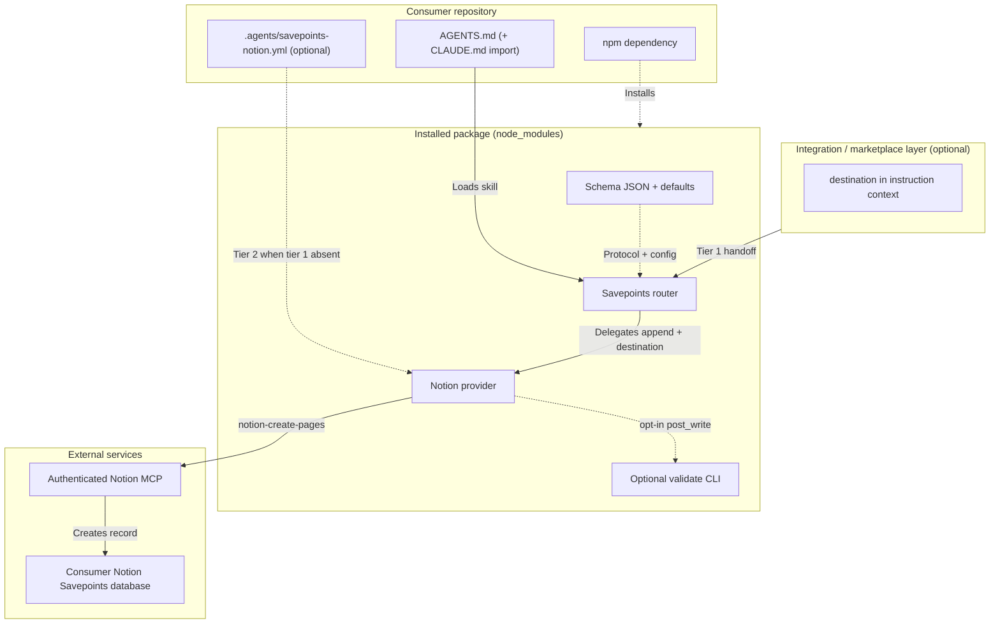

# Savepoints Lite architecture

`@multipliers-dev/savepoints-lite` ships router and provider **skills** (Markdown), default YAML, machine-readable schema/mapping JSON, and an **optional** deterministic post-write validator CLI. Default consumer behaviour remains instruction-only persistence via Notion MCP — no custom MCP server or local spool.

Contrast with [multipliers-dev/savepoints](https://github.com/multipliers-dev/savepoints): full Savepoints optimizes **durable learnings** (five-check rubric, lifecycle hooks, Postgres). Lite optimizes **activity and session narrative** with immediate appends and no lifecycle automation.


```mermaid
flowchart TB
    subgraph Consumer["Consumer repository"]
        Activation["AGENTS.md (+ CLAUDE.md import)"]
        Package["npm dependency"]
        AgentsYml[".agents/savepoints-notion.yml (optional)"]
    end

    subgraph Integration["Integration / marketplace layer (optional)"]
        Tier1["destination in instruction context"]
    end

    subgraph Installed["Installed package (node_modules)"]
        direction LR
        Schema["Schema JSON + defaults"]
        Router["Savepoints router"]
        Provider["Notion provider"]
        Validator["Optional validate CLI"]
    end

    subgraph External["External services"]
        MCP["Authenticated Notion MCP"]
        Database["Consumer Notion Savepoints database"]
    end

    Package -.->|"Installs"| Installed
    Integration -->|"Tier 1 handoff"| Router
    Activation -->|"Loads skill"| Router
    AgentsYml -.->|"Tier 2 when tier 1 absent"| Provider
    Schema -.->|"Protocol + config"| Router
    Router -->|"Delegates append + destination"| Provider
    Provider -->|"notion-create-pages"| MCP
    MCP -->|"Creates record"| Database
    Provider -.->|"opt-in post_write"| Validator
```

**Distribution** (dashed): one install step places packaged skills, contracts, and the optional CLI under `node_modules` — install alone does not activate Savepoints.

**Execution** (solid): consumer-owned agent instructions load the installed router; the router decides when to create Savepoints and assembles provider-neutral records; the configured provider persists through the consumer’s existing Notion MCP when a valid destination is resolved. Opt-in validation (dotted) runs only when `validation.post_write` is true.

## Layer model

| Layer | Responsibility |
| --- | --- |
| **Consumer activation** | Root `AGENTS.md` session-log section; Claude Code via `CLAUDE.md` (`@AGENTS.md`). [`docs/adopt.md`](./adopt.md). |
| **Integration (optional)** | Tier-1 `destination.data_source_id` in instruction/delegation context — marketplace wrappers, CI agents, etc. |
| **Router** [`skills/savepoints/SKILL.md`](../skills/savepoints/SKILL.md) | Event detection, Savepoint assembly, `storage.provider` / `validation.post_write`, carry tier-1 `destination` unchanged, load provider skill, handle outcomes. **No** Notion MCP or validator CLI. |
| **Provider** [`skills/savepoints-notion/SKILL.md`](../skills/savepoints-notion/SKILL.md) | Resolve destination (3 tiers), map Savepoint → Notion (`mapping.json`), MCP write, bounded confirmation; optional same-append verify/repair when validation is enabled. **Does not** decide when to Savepoint or read User Rules. |
| **Validator (optional)** | Deterministic CLI `savepoints-lite-validate` — checks persisted Notion properties against [`schema.json`](../skills/savepoints/schema.json) + Notion [`mapping.json`](../skills/savepoints-notion/mapping.json). No Notion credentials or MCP. |
| **Distribution** | npm package only — consumers must not vendor skills. |
| **Runtime** | Persistence uses the consumer’s **Notion MCP**. Executable validation is **opt-in** (`validation.post_write`); default remains instruction-only create/confirm. |

**Design principle:** Router owns **what** and **when**; static config and integration context select **where**; provider skills own **how** to persist; the optional validator owns **deterministic property checks** only.

## Savepoint protocol

Canonical field contract: machine-readable [`skills/savepoints/schema.json`](../skills/savepoints/schema.json); semantics in [`skills/savepoints/schema.md`](../skills/savepoints/schema.md).

Each meaningful work trigger produces **one new record** — no cross-event updates, dedupe, or batching. When `validation.post_write` is enabled, the Notion provider may read back, run the validator CLI, and at most once repair **that** record in the same append; it must not edit earlier rows.

## Configuration precedence

Static resolution only — no environment variables in v2.

**Router** — `storage.provider` and `validation.post_write`:

| Precedence | Location | Overrides |
| --- | --- | --- |
| 1 (highest) | Consumer `.agents/savepoints-lite.yml` (optional) | `storage.provider`, `validation.post_write` |
| 2 (default) | Package [`skills/savepoints/defaults.yml`](../skills/savepoints/defaults.yml) | `notion`; `validation.post_write: false` |

**Notion provider** — `destination.data_source_id`:

| Tier | Location | When |
| --- | --- | --- |
| 1 | Integration **instruction/delegation context** (`destination` YAML block) | Supplied for this delegation |
| 2 | Consumer `.agents/savepoints-notion.yml` (optional) | Tier 1 absent |
| 3 | Package [`skills/savepoints-notion/defaults.yml`](../skills/savepoints-notion/defaults.yml) | No id in `@2.0.0` |

**Fail open:** no valid id after applicable tiers → no MCP write. **Tier 1 invalid:** fail open without tier 2/3 fallback.

Unsupported or missing `storage.provider` after router resolution → report misconfiguration; do not guess.

Auth stays with each provider’s MCP (Notion MCP for v1).

## Append contract (behavioral)

```text
append(savepoint) → success | failure | unconfirmed
```

- **Same turn:** triggers require a Savepoint in the **same agent turn** as the work event.
- **Per event:** one trigger → one Savepoint → one delegation. **No retry queue.**

### Notion persistence (v1)

Authoritative behavior: [`skills/savepoints-notion/SKILL.md`](../skills/savepoints-notion/SKILL.md).

- **Synchronous-first:** `allow_async: false` when supported.
- **Bounded async:** at most **two** poll follow-ups, then `unconfirmed`.
- **Three outcomes:** `success`, `failure`, `unconfirmed` — do not claim persistence on `unconfirmed`.
- **Same-append verify/repair (opt-in):** when `validation.post_write` is true, after confirmed create: read-back → `savepoints-lite-validate` → at most one repair from the Savepoint already assembled for that append. Report missing persisted property, contract mismatch, verification unavailable, or repair confirmation unknown without flipping `success` to `failure`. Default off.

### Failure handling and anti-loop

On `failure` or `unconfirmed`: one-sentence report, resume primary work. A **failed append** is **not** a new work event.

## Privacy and reliability

- **Privacy:** Append-only rows in the consumer’s Notion data source (metadata + narrative sections). No credentials or maintainer destination ids in the package.
- **Reliability:** Best-effort; fail open; no background workers or local spool. Default path is instruction-only; optional deterministic validation does not call Notion.

## Maintenance

Public npm + GitHub; no implied SLA. Maintainer verification history: [adoption verification record on GitHub](https://github.com/multipliers-dev/savepoints-lite/blob/main/docs/adoption-verification-record.md) (repository only, not in tarball).

## v1 / v2 exclusions

Out of scope:

- General read/recovery flows, queues, background reconciliation, `emit-learning`, custom MCP server, local spool (opt-in same-append validate/repair is in scope)
- `savepoints-postgres` provider (future)
- Host User Rules as configuration source

Manual checklist: [`skills/savepoints/verification.md`](../skills/savepoints/verification.md).

## Skill index

[`skills/README.md`](../skills/README.md).
